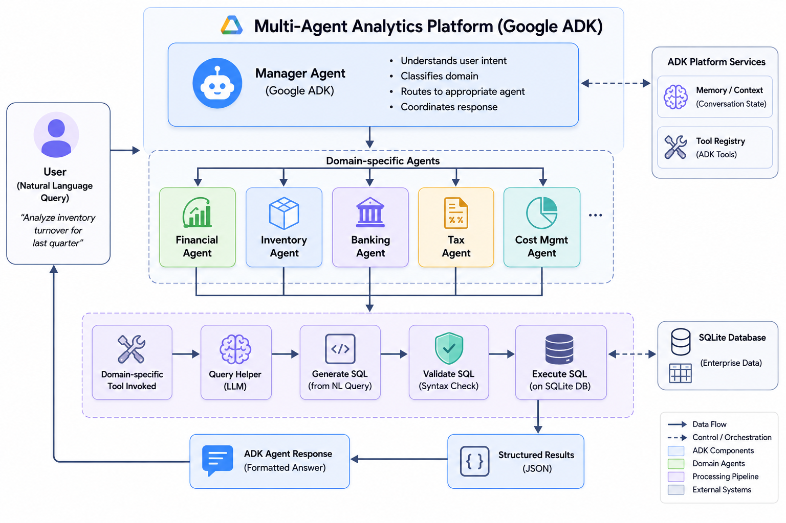
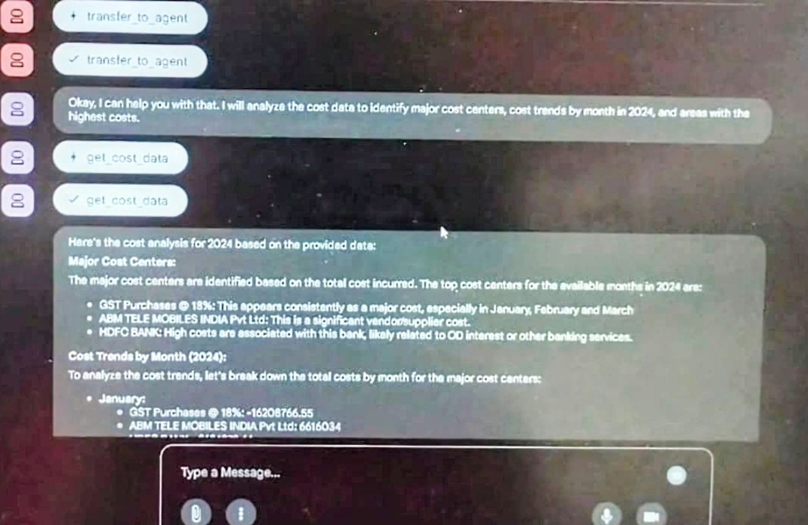
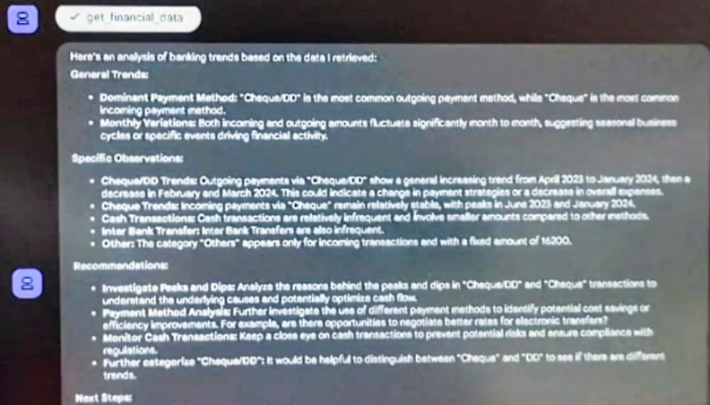

# TallyDB Multi-Agent Project

## Overview
The TallyDB Multi-Agent Project is designed to facilitate various analytical tasks related to financial data management using a multi-agent architecture. Each agent specializes in a specific domain, providing targeted insights and functionalities.



## Agents
- **Banking Analyst**: Analyzes banking data and generates reports.
- **Cost Management Analyst**: Analyzes costs and provides insights for cost reduction.
- **Financial Analyst**: Performs financial forecasting and analysis.
- **Inventory Analyst**: Tracks and optimizes inventory.
- **Tax and Compliance Analyst**: Ensures compliance with tax regulations and reporting.

## Tools
- **db_tools.py**: Utility functions for database operations, including connecting to TallyDB and executing queries.
- **print_tally_schema.py**: Function to print the schema of the TallyDB database.
- **query_helper.py**: Helper functions for constructing and executing database queries.
- **tools.py**: Various utility functions for logging and data formatting.

## Database Schema
Refer to `tally_database_schema[1].md` for detailed documentation on the TallyDB database schema, including structure, tables, and relationships.

## Demo / Outputs

| Query | Output |
|-------|--------|
| Financial Analytics |  |
| Cost Analysis |  |
| Inventory Insights |  |
| Tax Insights |  |
| Banking Analysis |  |

## Project Structure
```
tallydb-multi-agent
├── manager
│   ├── sub_agents
│   │   ├── banking_analyst
│   │   │   └── agent.py
│   │   ├── cost_management_analyst
│   │   │   └── agent.py
│   │   ├── financial_analyst
│   │   │   └── agent.py
│   │   ├── inventory_analyst
│   │   │   └── agent.py
│   │   └── tax_and_compliance_analyst
│   │       └── agent.py
│   ├── db_tools.py
│   ├── print_tally_schema.py
│   ├── query_helper.py
│   └── tools.py
├── tally_database_schema[1].md
└── README.md
```

## Setup Instructions
1. Clone the repository.
2. Install the required dependencies.
3. Configure the database connection in `db_tools.py`.
4. Run the agents as needed for specific analyses.

## Usage Guidelines
- Each agent can be executed independently based on the analysis required.
- Utilize the tools provided for database interactions and schema visualization.

## Contribution
Contributions to enhance the functionality of the agents or tools are welcome. Please submit a pull request with your changes.